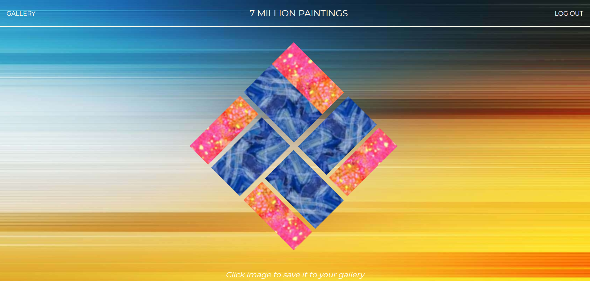

<h1>7 MILLION PAINTINGS</h1>

<a href="https://sevenmillionpaintings.herokuapp.com/"
  target="blank">https://sevenmillionpaintings.herokuapp.com/</a>
   
   

  
   

  
Welcome to 7 MILLION PAINTINGS!  This app searches through a library of curated computer generated composite images and compounds them together to create never before seen dynamic pieces of art to view AND save.  You can use this app like a visualizer while listening to music, or save your favorite pieces and use them for things like business cards, logos, and tee shirts, the possibilities are endless.
  

  
API built on node for user management and gallery updates.

  
App's frontend built using React.

   

  

  
This is a demo project and not a production.

